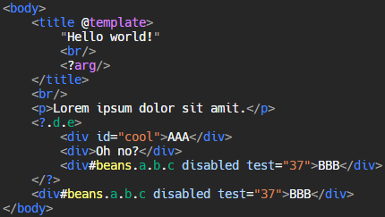

# Lua UI Markdown Language

## What is LUML
LUML is a basic implementation of XML/HTML intended for usage 
within LUI for building GUI screens and applications.

## Why?
~~after getting my xml parser working i got way too carried away
with adding shortcuts~~
Every popular HTML/XML based toolkit is based on chromium or a
javascript engine, which can bring down performance when used as a
desktop app engine with multiple instances open at once. This is 
the "HTML-mutation" language for this new framework, with optional
conveniences built in.

## my unofficial rambling
id and class shortcuts (DONE)
```html
<!-- use the following to specify ids and classes -->
<div #id .class .class2></div>
<!-- instead of the traditional property method -->
<div id="id" class="class class2"></div>
<!-- can ignore whitespace -->
<div#id.class.class2></div>
<!-- note that there is a difference between the id, and the property "id"
	 css selectors will only select ids, not the property 
	 same goes for classes -->
<div id="foo" #bar></div>
<!-- this creates an element with the id '#bar' -->
```
evaluated properties (DONE)
```html
<div foo=(1+2)></div>
<!-- also functions -->
<div onclick=(function ()
	print("I've been clicked!")
end)></div>
```
? element (PARSED)
```xml
<!-- can be used for grouping -->
<!-- will pass all attributes to "children" -->
<!-- not an actual element, or a psudo element -->
<? .someClass fruit="apple">
	<div></div>
	<p></p>
	<h1></h1>
</?>
<!-- can be used as generic closer -->
<div>
	<span>
		<p>
			Hello world!
		</?>
	</?>
</?>
```
psudo-structures
```html
<!-- stores all elements in memory -->
<div #hello>
	<span .abc>
		<foo bar="true">
			<p .text>Hello world!</p>
		</foo>
	</span>
</div>
<!--	psudo structures: rendered and css selected,
		but stored and treated as one element			-->
<div#hello, span.abc, foo bar="true", p.text>Hello world!</?>
<!-- can also default to top closer -->
<div#hello, span.abc, foo bar="true", p.text>Hello world!</div>
<!-- also useful with multiple identical elements -->
<div>hello</div>
<div>hello</div>
<div>hello</div>
<div>hello</div>
<div>hello</div>
<!-- alternatively: -->
<div^5>hello</div>
```
templates (PARSED)
```html
<!-- declaration -->
<div @templateName>
	<h1>Hello world!</h1>
	<p>Lorem ipsum dolor sit amit.</p>
</div>
<!-- usage -->
<@templateName/>
<!-- unlike psudo-structures, will unpack the elements individually -->
<!-- arguments -->
<div @survey>
	<h1>Survey: <?title></h1>
	<p><??></p>
</div>
<!-- <??> serves as content placeholder -->
<!-- usage -->
<@survey title="Pineapples on pizza?">
	<checkbox>I love it!</checkbox>
	<checkbox>This does not apply, I have no mouth.</checkbox>
</@survey>
```
continue tag (SCRAPPED)
```html
<!-- not sure about this one -->
<table>
	<tr>
		<td>
			<p>Hi!</p>
		</td>
		<td>
			<p>Hi!</p>
		</td>
	</tr>
	<tr>
		<td>
			<p>Hi!</p>
		</td>
		<td>
			<p>Hi!</p>
		</td>
	</tr>
</table>
<!-- assuming psudo structures arent applicable here -->
<!-- introducing <*> -->
<table>
	<tr>
		<td>
			<p>Hi!</p>
		<*>
			<p>Hi!</p>
		</td>
	<*>
		<td>
			<p>Hi!</p>
		<*>
			<p>Hi!</p>
		</td>
	</tr>
</table>
<!-- closes and reopenes an identical element -->
<!-- more useful over large amounts of elements -->
<!-- probs gonna scrap this one -->
```